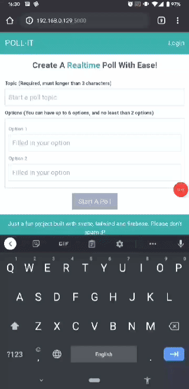

# Poll-it

Just a simple straw poll like app...

  

Since it's just a little bit try out of svelte and stuffs, I'm not going to implement login function, hence there's no limitation of votes/person restrict. (althought I can still make it with session storage or local storage and stuffs like that, but it's just for fun, don't really bother it).

But...

Please don't spam :P

## Technologies

- [svelte](https://svelte.dev/ "svelte") (because it seems fun :D)
- [tailwind](https://tailwindcss.com/, "tailwind") (utility styling is a cool idea)
- [firebase](https://firebase.google.com "firebase") (i'm just too lazy to build a backend for this)
- [typescript](https://www.typescriptlang.org/, "typescript") (ts is really crappy with svelte :/)

---

@ LCTOAN.
